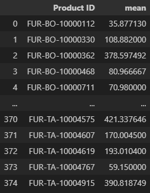
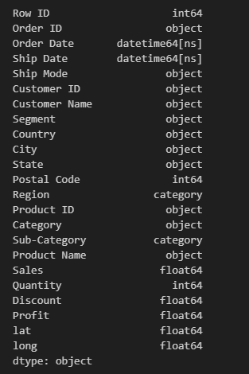
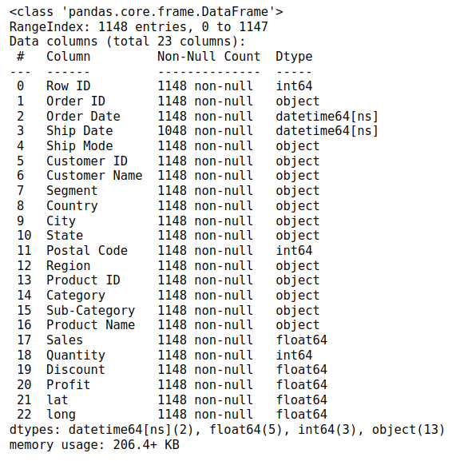
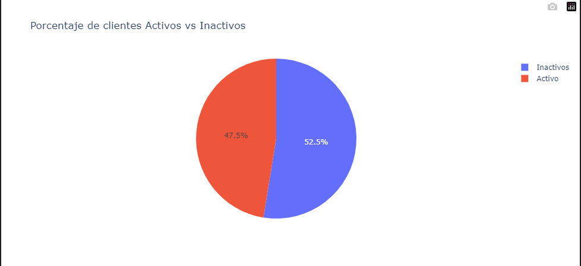
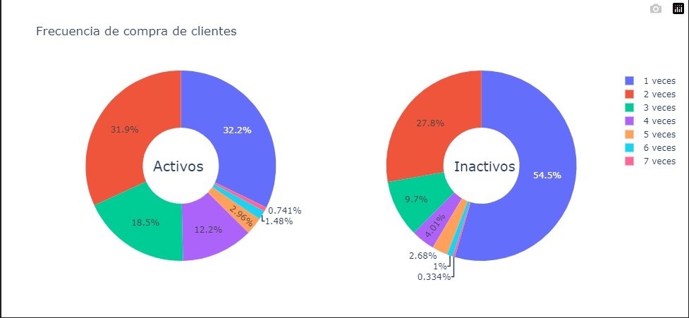

# Analisis de ventas en tienda tipo Retail

Para este proyecto se contó con la información de las transacciones de ventas de la empresa “Super Store”, en los cuales se descubrieron nuevos insights que buscan generar propuestas de valor para el beneficio de la empresa.

A continuación, se presenta el proceso que se llevó a cabo para generar los diferentes insights a partir del análisis exploratorio de los datos:

**Librerías que se utilizaron:**

```python
import pandas as pd
import numpy as np
import matplotlib.pyplot as plt
import plotly.express as px
import seaborn as sns
import geopandas as gpd
import folium
from folium.plugins import MousePosition
import plotly.graph_objects as go
from plotly.subplots import make_subplots
```

### **Limpieza del dataset:**

Para la limpieza de datos se revisa primero que no tenemos valores vacíos/nulos. 

Se revisa los campos que se tienen disponibles. Entre ellos se encontraron cambios por realizar en las columnas de coordenadas, Sales, Profit, fechas de orden y fechas de entrega.

- Para las coordenadas. Se revisa que se encuentran escritas como “(37.8393, -84.27)”. Además, se tiene valores con “vacíos” que incluian el valor “Unknown”. Por lo que se retira los “Unknown” y se procede a separar en columnas distintas de nombre “lat” y “long”
- Se modifica el campo “Sales” en los casos que tienen un valor de 1. Para imputar esos valores de ventas se considera en los promedios de valor en sales por Product ID.



- Se retira los casos en los que “Profit” tiene valores negativos.
- Se modifica los casos en los que la fecha de orden es mayor a la fecha de llegada. Para ello se realiza una pequeño ajusto en esos casos al considerar la fecha de orden como correcta y se suma los días en los que en promedio ese tipo de envío suele tardar en llegar.

Se modifico el tipo de variables acorde a cada uno. resultando en lo siguente:

```python
df_nuevo.dtypes
```



---

### **Carga de dataset limpio:**

```python
df = pd.read_csv('/ruta_archivo/clean_data.csv', parse_dates=['Order Date', 'Ship Date'])
df = df.drop(columns=['Unnamed: 0'])
df['Ship Date'] = pd.to_datetime(df['Ship Date'], errors='coerce')
```

**Vista preliminar de las columnas con data limpia y formato correcto:**

```python
df.info()
```



Las fechas se las trabaja con formato **datetime**, y las coordenadas geográficas como **float**.

---

### **Análisis Univariado:**

1. Primera variable: `Sales`
    
    Se obtienen las medidas de tendencia central:
    
    ```python
    df.Sales.describe()
    ```
    
    
    
    De estos datos podemos destacar lo siguiente:
    
    - Las ventas generan un promedio de $228 (se asume que el tipo de moneda es el dólar americano).
    - En general, las ventas se desvían 275 unidades del promedio de ventas.
    - El 75% de las ventas generan el promedio $300, esto es $72 más que la media. Esto es una buena señal, ya que, la mayor parte de las ventas superan el promedio.
    
    Diagrama de cajas:
    
    ```python
    plt.figure(figsize=(10, 6))
    sns.boxplot(x=df['Sales'])
    plt.title('Boxplot of Sales')
    plt.xlabel('Sales')
    plt.show()
    ```
    
    
    
    El gráfico indica que una gran parte de las transacciones han sido de bajo valor monetario comparado con el promedio.
    
2. Segunda variable: `Quantity`
    
    Se obtienen las medidas de tendencia central:
    
    ```python
    df.Quantity.describe()
    ```
    
    
    
    De estos datos podemos destacar lo siguiente:
    
    - En cada transacción en promedio se venden 4 unidades.
    - En general, la cantidad de unidades se desvía 5.27 del promedio de unidades vendidas.
    - La mitad del total de las transacciones vende 3 unidades.
    
    Histograma:
    
    ```python
    plt.figure(figsize=(10, 6))
    sns.histplot(df['Sales'], bins=30, kde=False)
    plt.title('Histogram of Sales')
    plt.xlabel('Sales')
    plt.ylabel('Frequency')
    plt.show()
    ```
    
    
    
    Cada transacción en promedio vende 4 unidades con una frecuencia notablemente alta, lo que provoca que exista un gran volumen de ventas para este rango de unidades.
    
3. Tercera variale: `Profit`
    
    Se obtienen las medidas de tendencia central:
    
    ```python
    df.Profit.describe()
    ```
    
    
    
    De estos datos podemos destacar lo siguiente:
    
    - Cada transacción en promedio genera una ganancia bruta de $38.
    - En general, la ganancia bruta se desvía $52 del promedio.
    - Existe una ganancia bruta aislada de $334, aunque la mayor parte de las transacciones solo han generado $45 de ganancia.
    
    Histograma:
    
    ```python
    plt.figure(figsize=(10, 6))
    sns.histplot(df['Profit'], bins=30, kde=False)
    plt.title('Histogram of Profit')
    plt.xlabel('Profit')
    plt.ylabel('Frequency')
    plt.show()
    ```
    
    
    
    Este claro sesgo a la derecha indica que son pocas las transacciones que representan una gran cantidad de ganancia bruta, por el contrario, la mayoría oscilan en $45 en promedio.
    

---

### **Análisis Multivariado:**

1. Variables: `Sub-Category`, `Profit`, `Sales`
    
    Se toman estas variables para identificar la ganancia burta y ventas por cada sub categoría de productos:
    
    ```python
    #Se agrupa por Sub'Category
    df_product_by_sales_profit = df.groupby('Sub-Category').agg({"Sales": ['sum'], "Profit": ['mean']}).reset_index()
    
    df_product_by_sales_profit.columns = df_product_by_sales_profit.columns.droplevel(1)
    
    #Se escalan ambas columnas para representarlas correctamente en el grafico de barras
    df_product_by_sales_profit.Sales = df_product_by_sales_profit.Sales/df_product_by_sales_profit.Sales.max()
    df_product_by_sales_profit.Profit = df_product_by_sales_profit.Profit/df_product_by_sales_profit.Profit.max()
    
    df_product_by_sales_profit.sort_values(by = 'Sales', ascending = False, inplace = True)
    
    #Grafico
    fig_product_by_sales_profit = px.bar(df_product_by_sales_profit, x = df_product_by_sales_profit['Sub-Category'], y = df_product_by_sales_profit.columns, title = 'Ventas por producto')
    fig_product_by_sales_profit.show()
    ```
    
    
    
    **Análisis:** Tables es la sub categoría de producto más rentable, debido a que, aunque haya generado pocas ventas, su valor de ganancia bruta es mucho mayor. Este mismo escenario se repite para Bookcases. Por el contrario, Furnishings no genera mucha ganancia comparado con la cantidad de ventas.
    
2. Variables: `Segment`, `Quantity`
    
    Se toman estas variables para identificar la cantidad de unidades vendidas dependiendo del segmento de clientes.
    
    ```python
    #Quantity
    df_quantity_by_segment = df.groupby(['Segment', 'Product ID'])['Quantity'].sum().reset_index().sort_values(by = ['Segment','Quantity'], ascending = [True, False])
    df_quantity_by_segment = df_quantity_by_segment.groupby('Segment').head(1)
    df_quantity_by_segment
    
    #Discount
    df_discount_by_segment = df.groupby(['Segment', 'Product ID'])['Discount'].mean().reset_index().sort_values(by = ['Segment','Discount'], ascending = [True, False])
    df_discount_by_segment = df_discount_by_segment.groupby('Segment').head(1)
    df_discount_by_segment.Discount = df_discount_by_segment.Discount * 100
    df_discount_by_segment
    
    #Grafico
    fig, axes = plt.subplots(nrows=1, ncols=2, figsize=(14, 6))
    
    axes[0].pie(df_quantity_by_segment['Quantity'], labels=df_quantity_by_segment['Segment'], autopct='%1.0f%%', startangle=90)
    axes[0].set_title('Quantity Distribution')
    
    axes[1].bar(df_discount_by_segment['Segment'], df_discount_by_segment['Discount'])
    axes[1].set_title('Discount Distribution')
    axes[1].set_xlabel('Segment')
    axes[1].set_ylabel('Discount')
    
    plt.show()
    ```
    
    
    
    **Análisis:**El segmento que mas cantidades de unidades vendidas (Quantity) genera es el *Consumer*, lo que es directamente proporcional a la cantidad de descuento que estos perciben (*Discount*), ya que, este segmento suele tener el porcentaje de descuento más alto de todas las categorías, con un 30%. Mientras que los otros dos segmentos solo poseen un 20% de descuento, y entre ambos segmentos representan la mitad del total de unidades vendidas.
    

---

### **Preguntas para el Análisis**

**¿Cómo manejarías los valores nulos en el dataset?**

No existen valores nulos en el dataset, sin embargo, en el caso de que sí existiesen, se valoraría una posible imputación, de manera que no afecte a la tendencia e integridad de los datos.

**¿Qué estrategfias utilizarías para corregir los formatos inconsistentes en las columnas de texto?**

Crearía una función que se encargue de regularizar los textos, por ejemplo, existen valores que tienen los caracteres “—”, en estos casos la función se encargaría de eliminar estos caracteres

**¿Cuál es la distribución de las ventas ('Sales') en el dataset?**

```python
df_sales_distribution = df.set_index(df['Order Date'])
yearly_sales = df_sales_distribution.resample('Y')['Sales'].sum().reset_index()
fig_sales_year = px.line(yearly_sales, x = yearly_sales['Order Date'], y = yearly_sales.columns, markers = True, title = 'Ventas por año')
fig_sales_year.show()
```


**Análisis**: en el gráfico se puede observar una tendencia creciente en cuanto a las ventas a lo largo del tiempo. También es importante observar que desde 2025, las ventas nunca bajaron, en ningún mes.

**¿Existen diferencias significativas en la cantidad de productos vendidos ('Quantity') entre las diferentes categorías de productos?**

```python
df_quantity_by_category = df.groupby('Sub-Category').agg({'Quantity':['sum'], 'Sales':['sum'], 'Profit':['mean']}).reset_index()
df_quantity_by_category.columns = df_quantity_by_category.columns.droplevel(1)
total_sales = df_quantity_by_category.Quantity.sum()
df_quantity_by_category['Percent'] = ((df_quantity_by_category.Quantity/total_sales)*100).round(0)
df_quantity_by_category

fig, axes = plt.subplots(nrows=1, ncols=2, figsize=(14, 6))
# Gráfico circular para Sales
axes[0].pie(df_quantity_by_category['Quantity'], labels=df_quantity_by_category['Sub-Category'], autopct='%1.0f%%', startangle=90)
axes[0].set_title('Sales Distribution')

# Gráfico de barras para Quantity
axes[1].bar(df_quantity_by_category['Sub-Category'], df_quantity_by_category['Sales'], label='Sales', color='blue', alpha=0.9)
axes[1].set_xlabel('Sub-Category')
axes[1].set_ylabel('Sales', color='blue')
axes[1].tick_params(axis='y', labelcolor='blue')

# Crear un segundo eje y para los 'Profit'
axes1 = axes[1].twinx()
axes1.bar(df_quantity_by_category['Sub-Category'], df_quantity_by_category['Profit'], label='Profit', color='green', alpha=0.9)
axes1.set_ylabel('Profit', color='red')
axes1.tick_params(axis='y', labelcolor='red')

plt.title('Sales and Profit by Sub-Category')
axes[1].legend(loc='upper left')
axes1.legend(loc='upper right')

plt.show()
```


**Análisis:** en cuanto a cantidad de unidades vendidas (Quantity), existe una gran diferencia entre la categoría Furnishings respecto a las demás, con un 64% del total. Sin embargo, en cuanto al total de ventas por categoría (Sales) la situación cambia, siendo Chairs el producto que más ventas ha generado.

<aside>
💡 Aunque el producto Tables es uno de los productos menos vendido, es el más rentable, debido a que genera unas ganancias en promedio de $71 y encabeza la lista de los productos más rentales.

</aside>

**¿Cuáles son los estados con el mayor volumen de ventas y cómo varía esto por categoría de producto?**

```python
df_sales_by_state = df.groupby(['Sub-Category', 'State'])['Sales'].sum().reset_index()
df_sales_by_state = df_sales_by_state.sort_values(by=['Sub-Category','Sales'], ascending=[True, False])
top_states_by_category = df_sales_by_state.groupby('Sub-Category').head(3)
df_pivot = top_states_by_category.pivot(index='Sub-Category', columns='State', values='Sales')
df_pivot.plot(kind='bar', figsize=(12, 8), zorder=3, title='Top 3 State Sales by Sub-Category')\
    .set(xlabel='Sub-Category', ylabel='Sales', xticklabels=df_pivot.index)
```


**Análisis:** el estado de California es el único que se encuentra presente en el top de estados con más volúmen de ventas en las 4 categorías de productos existentes. El producto Chairs es con diferencia el producto más vendido en California y New York.

**¿Cómo varían las ventas y la cantidad de productos vendidos a lo largo de las diferentes estaciones del año?**

```python
df_season = df

#Agrupo fechas por estaciones
df_season.loc[df_season['Order Date'].dt.month.isin([12,1,2]), 'Season'] = 'Invierno'
df_season.loc[df_season['Order Date'].dt.month.isin([3,4,5]), 'Season'] = 'Primavera'
df_season.loc[df_season['Order Date'].dt.month.isin([6,7,8]), 'Season'] = 'Verano'
df_season.loc[df_season['Order Date'].dt.month.isin([9,10,11]), 'Season'] = 'Otoño'

df_sales_by_season = df_season.groupby('Season')['Sales'].sum().reset_index()
df_quantity_by_season = df_season.groupby('Season')['Quantity'].sum().reset_index()

#Grafico
fig, (ax1, ax2) = plt.subplots(1, 2, figsize=(16, 6))
sns.barplot(data = df_sales_by_season, x = 'Season', y = 'Sales', ax=ax1)
sns.barplot(data = df_quantity_by_season, x = 'Season', y = 'Quantity', ax=ax2)
```


Análisis: a lo largo de las diferentes estaciones del año, se puede observar que las ventas son  proporcionales a la cantidad de unidades vendidas. Otoño es la época donde más ventas se realizan, esto cobra sentido debido a que esta temporada comprende los meses de (septiembre, octubre, noviembre), sobretodo noviembre, mes donde acontece el Black Friday, octubre se celebra Hallowen. Por otro lado, Primavera es la etapa menos rentable, esto porque comprende los meses de (marzo, abril, mayo), en los cuales acontecen fechas como el Spring Break, donde la gente aprovecha para irse de vacaciones, por lo tanto, no acostumbran a realizar compras de estas categorías de productos.

**Crea un gráfico de barras que muestre las ventas totales por estado. ¿Qué estados son los más rentables?**

```python
df_salesByState = df.groupby('State')['Sales'].sum().reset_index()
mean_sbs = df_salesByState.Sales.mean()

df_other_states = df_salesByState[df_salesByState.Sales < mean_sbs]
df_other_states = pd.DataFrame({'State': ['Other States'], 'Sales': df_salesByState[df_salesByState.Sales < mean_sbs].Sales.sum()})
#Obtenemos el valor promedio de ventas, este será el umbral para agrupar los estados que se encuentren debajo del promedio, estos serán agrupados en la categoría "Other States (OT)"

states_to_plot = df_salesByState[df_salesByState.Sales >= mean_sbs]
df_to_plot = pd.concat([states_to_plot, df_other_states], ignore_index=True)

#Creamos una función para extraer los primeros 2 caracteres de cada estado, esto para que el gráfico sea más limpio.
def reduceNameState(state):
    return state.upper()[:2]
    
df_to_plot.State = df_to_plot.State.apply(reduceNameState)
df_to_plot = df_to_plot.sort_values(by='Sales', ascending=False)
sns.barplot(data = df_to_plot, x = 'State', y = 'Sales')
```


**Análisis**: omitiendo el primer estado (Otros estados OT), se puede observar que California es con diferencia el estado donde existen la mayor cantidad de ventas, luego le sigue New York. A partir de ahí, todos los demás estados poseen cantidades muy similares de ventas.

### ¿**Cuántos clientes "activos" o "inactivos" se tienen?**

Para decidir si un cliente es activo o inactivo revisamos cuales de los clientes han realizado una compra dentro del ultimo año desde la fecha de la última orden de compra que se tiene registrada.

 

```python
Clientes_activos = df
Clientes_activos["Recencia_Order"] = (Clientes_activos["Order Date"].max() - Clientes_activos["Order Date"]).dt.days
Clientes = Clientes_activos.groupby("Customer ID")["Recencia_Order"].agg(["min","count"]).reset_index()
Clientes["Estado"]=np.where(Clientes["min"]<365,"Activo","Inactivos")
```



### **¿Cuántas veces compran los clientes activos?**

Se revisa de entre los clientes activos e inactivos, que tan frecuente son sus compras. De esto se halla que de la mayor parte de los clientes (activos e inactivos) compran entre 1 a 3 veces en total.  

```python
Clientes["Frecuencia"] = Clientes["count"].astype(str)+" veces"
Clientes = Clientes.groupby(["Frecuencia","Estado"])["min"].count().reset_index()
Clientes = pd.pivot_table(data=Clientes,values="min",index="Frecuencia",columns="Estado",fill_value=0).reset_index()
```

